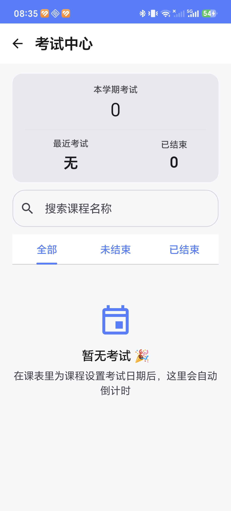
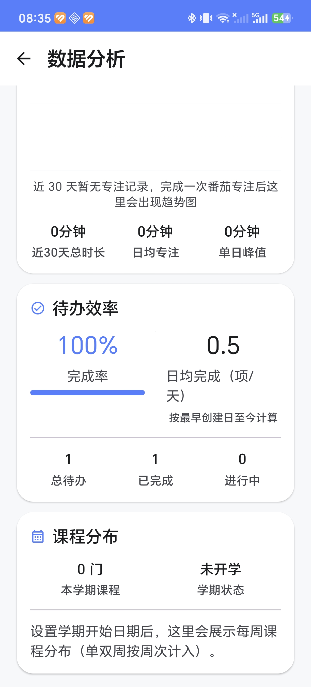

# SmartLife · 大学生活助手

> 基于 Kotlin + Jetpack Compose 开发的 Android 校园效率工具：待办、番茄专注、单双周课表、**考试中心**、**桌面小组件**与**数据分析**。

<p align="center">
  
  
  
  
  
  
</p>

## 📦 Download

> 从 Releases 页面下载最新 APK，安装时允许「未知来源」即可。

👉 **[Download SmartLife APK · v2.1.0](/releases/latest)**

| 项目 | 值 |
| --- | --- |
| 版本号 | `2.1.0`（versionCode 4） |
| 包名 | `com.smartlife.app` |
| APK 体积 | 约 12 MB |
| 最低系统 | Android 7.0（API 24） |

---

## 🆕 v2.1.0 更新亮点

| 模块 | 内容 |
| --- | --- |
| **🗓 周次范围** | 每门课可设「起始周 / 结束周」（如 1-16、11-16、3-16、1-15），首页今日课程 / 课表 / 提醒 / 统计统一按区间过滤，不再把课程当"全学期"显示 |
| **📘 课程性质** | 新增「考试课 / 考查课 / 未知」，编辑时可选择；课表卡片右上角显示对应徽标（M3 语义色，深浅色自适应） |
| **💾 数据库升级** | Room v3 → v4（一次性迁移，旧课程自动补全为 1-16 周 + 未知性质，零数据丢失） |
| **🔌 其它** | 备份 / 恢复兼容新字段；周次区间判定下沉到 `WeekUtils.isActive` 统一出口 |

### 🚧 主分支开发中（尚未发版）

- **周网格视图**：课表第三种视图，教务式「星期 × 节次段」整周总览，支持上一周 / 下一周 / 回到本周、今日高亮、点击课程直接编辑
- **节次时刻表**：可自定义第 1~10 节上课时间（课表页右上角齿轮），新增 / 编辑课程支持「第1-2节」等一键快捷填充
- **批量导入增强**：CSV 导入升级为完整版 10 列格式（老师 / 周次范围 / 课程性质），兼容旧 7 列文件

---

## 🆕 v2.0.0 更新亮点

| 模块 | 内容 |
| --- | --- |
| **📝 考试中心** | 独立二级页面：D-Day 大数字倒计时、顶部统计（总数 / 已结束 / 最近考试）、课程名实时搜索、**全部 / 未结束 / 已结束**三档筛选（默认未结束）、教室信息、按紧急程度分色（≤7 天红 / 8–30 天橙 / >30 天蓝） |
| **🧩 桌面小组件 2.0** | 双尺寸：**2×2** 显示今日待办数 + 下一节课程；**4×2** 显示课程 / 待办 / 专注时长 + **「一键开始专注」**按钮。深浅色自适应，回前台自动刷新 |
| **📊 数据分析** | 全新页面：专注趋势（近 7 天柱状图 + 近 30 天折线图）、待办效率（完成率 / 日均完成数 / 总量明细）、课程分布（课程总数 + 每周课程数柱状图，单双周按周次计入）。**全部基于已有数据内存计算，未新增任何数据库字段** |
| **✨ 动画统一** | 新增 `ui/theme/Animation.kt` 作为全 App 动画规范的单一事实来源，消除全部魔法数字；页面切换、列表、图表、数字滚动节奏一致 |

---

## 📱 Screenshots

> 以下为**真机实拍截屏**（v1.x 基础功能）。

| 首页 Home | 待办 Todo |
| --- | --- |
|  |  |

| 专注 Focus | 课表 Timetable |
| --- | --- |
|  |  |

### v2.0.0 新增页面

v2.0.0 三个新界面的实拍进度：考试中心 / 数据分析已实拍补充；桌面小组件截图待补。

| 文件名 | 对应页面 | 状态 |
| --- | --- | --- |
| `exam.png` | 考试中心（考试列表 + D-Day 统计卡） | ✅ 已实拍 |
| `analytics.png` | 数据分析（专注趋势 / 待办效率 / 课程分布三卡） | ✅ 已实拍 |
| `widget.png` | 桌面小组件（2×2 与 4×2 同屏） | ⬜ 待补 |

| 考试中心 Exam | 数据分析 Analytics |
| --- | --- |
|  |  |

> 📌 本仓库**不提交任何占位图或合成图**——截图一律来自真机 / 模拟器实拍。桌面小组件截图待用户在桌面添加 SmartLife 2×2 / 4×2 后实拍补齐。

---

## ✨ 功能介绍

### 🏠 Dashboard · 首页
今日日期与时段化励志语（点按换一条），「今日待办 / 今日课程 / 今日专注」三张统计卡片可点击直达对应模块；考试倒计时卡（D-Day 分色）；今日目标三态展示（空 / 进行中 / 已完成，数字滚动 + 进度条动画）。

### ✅ Todo · 待办
新增 / 编辑 / 删除（长按确认）、完成勾选、三级优先级、**截止日期 + 时间**（精确到分钟）、实时搜索、逾期提示（已逾期 X 小时）、平滑的列表重排与删除动画。

### 🍅 Focus · 番茄专注
预设 15 / 25 / 45 / 60 分钟 + 自定义（5~180 分钟）；开始 / 暂停 / 继续 / 结束；圆形倒计时动画；**退出页面计时不中断**（基于绝对时间戳）；结束经 WorkManager 本地通知提醒。

### 📚 Timetable · 课程表
列表 / 时间轴 / **周网格**三种视图；周一至周日切换、**多星期课程**、**单双周（每周 / 单周 / 双周）**、**周次范围（起始~结束周）**、**课程性质（考试课 / 考查课）**、**学期设置**（自定义开学日期，自动推算当前周次）、**上一周 / 下一周 / 回到本周**、**节次时刻表**（自定义第 1~10 节时间，编辑课程一键按节次填充）、CSV 批量导入课程（完整版支持老师 / 周次范围 / 课程性质）、任课老师 / 教室 / 时间、考试日期。

### 📝 Exam Center · 考试中心（v2.0.0）
独立页面集中管理全部考试：D-Day 倒计时统计卡、实时搜索、三档筛选 Tab、教室展示、按紧急程度自动分色。数据复用课程表的考试日期字段，无需重复录入。

### 🧩 Widget · 桌面小组件（v2.0.0）
原生 `RemoteViews` 实现，无额外依赖：

| 尺寸 | 内容 | 点击行为 |
| --- | --- | --- |
| 2×2 | 今日待办数 + 下一节课程（时间 / 教室） | 整卡 → 首页 |
| 4×2 | 下一节课程 / 今日待办 / 今日专注 / 一键开始专注 | 分区跳转；按钮直接进入专注并自动开始 |

### 📊 Analytics · 数据分析（v2.0.0）
- **专注趋势**：近 7 天柱状图（今天高亮）+ 近 30 天折线图（Canvas 手绘，含网格线、面积填充、数据点），附总时长 / 日均 / 单日峰值；
- **待办效率**：完成率大数字 + 进度条、日均完成数（按最早创建日至今计算）、总量明细；
- **课程分布**：课程总数、当前周次、每周课程数柱状图（单双周课程按周次计入，课程最多的周高亮）。

### 👤 Profile · 我的
数据统计（总待办 / 已完成 / 总专注时长 / 完成轮数）、**当前学期课程**入口、**考试中心**入口、**数据分析**入口、课程提醒设置（开关 + 提前分钟数）、主题切换（跟随系统 / 浅色 / 深色）、JSON 一键导入导出、学期设置、关于。

---

## 🛠 技术栈

| 技术 | 用途 |
| --- | --- |
| Kotlin 2.0 | 开发语言 |
| Jetpack Compose | 声明式 UI |
| Material 3 | 设计规范（含深浅色双套配色） |
| Room | 本地数据库（version 4，KSP） |
| DataStore | 设置与偏好存储 |
| WorkManager | 后台任务（专注结束提醒、课程提醒） |
| Navigation Compose | 页面路由 |
| RemoteViews | 桌面小组件（原生，不引入 Glance） |

**架构**：MVVM + Repository + 单向数据流（Room Flow → Repository → ViewModel StateFlow → Compose UI）。

---

## 📂 项目结构

```
SmartLife/
├── app/
│   ├── build.gradle.kts
│   └── src/main/
│       ├── AndroidManifest.xml
│       ├── java/com/smartlife/app/
│       │   ├── SmartLifeApplication.kt
│       │   ├── MainActivity.kt
│       │   ├── data/
│       │   │   ├── local/
│       │   │   │   ├── AppDatabase.kt
│       │   │   │   ├── Converters.kt
│       │   │   │   ├── CourseType.kt        ← v2.1（考试课 / 考查课 / 未知）
│       │   │   │   ├── Priority.kt
│       │   │   │   ├── WeekType.kt
│       │   │   │   ├── dao/          (Backup / Course / FocusSession / Quote / Task)
│       │   │   │   └── entity/       (Course / FocusSession / Quote / Task)
│       │   │   ├── QuotesProvider.kt
│       │   │   └── repository/       (Course / FocusSession / Quote / Settings / Task)
│       │   ├── di/ServiceLocator.kt
│       │   ├── ui/
│       │   │   ├── components/       (CountUpText / DateField / TimeField)
│       │   │   ├── navigation/       (NavGraph / Routes)
│       │   │   ├── screen/
│       │   │   │   ├── analytics/    (AnalyticsScreen / AnalyticsViewModel)   ← v2.0.0
│       │   │   │   ├── dashboard/    (DashboardScreen / DashboardViewModel)
│       │   │   │   ├── exam/         (ExamListScreen / ExamListViewModel)     ← v2.0.0
│       │   │   │   ├── focus/        (FocusScreen / FocusViewModel)
│       │   │   │   ├── profile/      (ProfileScreen / ProfileViewModel)
│       │   │   │   ├── reminder/     (CourseReminderScreen)                   ← v1.2
│       │   │   │   ├── semester/     (Semester / SemesterCourses)
│       │   │   │   ├── timetable/    (Timetable / CourseAddEditDialog / CoursePeriodSettingsDialog) ← v2.2
│       │   │   │   └── todo/         (Todo / TodoAddEditDialog)
│       │   │   └── theme/
│       │   │       ├── Animation.kt   ← v2.0.0 全 App 动画规范
│       │   │       ├── Color.kt / Shape.kt / Theme.kt / ThemeMode.kt / Type.kt
│       │   ├── util/                 (CoursePeriod / CsvCourseParser / DateUtils / JsonBackup / WeekUtils)
│       │   ├── widget/               (BaseWidgetProvider / SmartLifeWidgetProvider / …Wide) ← v2.0.0
│       │   └── worker/               (FocusReminderWorker / CourseReminderWorker / Scheduler)
│       └── res/
│           ├── drawable/  layout/  mipmap-anydpi-v26/
│           ├── values/      # 浅色主题 + 小组件配色
│           ├── values-night/# 深色主题 + 小组件配色
│           └── xml/         # 小组件配置（appwidget-provider）
├── screenshots/            # 真机截图
├── gradle/wrapper/         # Gradle Wrapper 8.9
├── keystore.properties     # Release 签名配置（不入库）
├── README.md
├── LICENSE
└── .gitignore
```

## 🏗 架构

```
Compose UI
    ↓  用户事件
ViewModel (StateFlow)
    ↓
Repository (Flow)
    ↓
Room + DataStore
```

## 🚀 环境要求

- **Android Studio**（新版即可，自带 JDK）
- **最低 Android 版本**：Android 7.0（API 24）
- **目标 / 编译 SDK**：34
- **JDK**：17
- **Gradle**：8.9（Wrapper 已内置）；AGP 8.7.0；Kotlin 2.0.21

## 📲 如何运行

1. 安装 **Android Studio**；
2. `File → Open` 选择本目录 `SmartLife/`；
3. 等待 Gradle Sync 完成（首次需联网下载依赖）；
4. 点击 **Run ▶** 选择模拟器或真机运行。

## 📦 如何构建 APK

```bash
# Debug APK（使用 SDK 默认调试签名）
./gradlew assembleDebug
# 产物：app/build/outputs/apk/debug/app-debug.apk

# Release APK（签名后）
./gradlew assembleRelease
# 产物：app/build/outputs/apk/release/app-release.apk
```

**Release 签名配置**：在项目根目录创建 `keystore.properties`（已在 `.gitignore` 中忽略，不会入库）：

```properties
storeFile=smartlife-release.jks
storePassword=<你的 store 密码>
keyAlias=<你的 key 别名>
keyPassword=<你的 key 密码>
```

`app/smartlife-release.jks` 同样不入库，请自行妥善备份——**丢失 keystore 将无法为后续版本提供升级签名**。
未配置该文件时 `assembleRelease` 仍可执行，但产物为未签名 APK。

验证签名：

```bash
apksigner verify --verbose --print-certs app/build/outputs/apk/release/app-release.apk
```

## 💾 数据备份 / 恢复

- **导出**：「我的」→「数据管理」→「导出 JSON」→ 系统分享保存；
- **导入**：「导入 JSON」→ 选择备份文件；
- 备份内容：待办、课程、专注记录、励志语；
- 安全机制：导入前完整校验 JSON，校验通过后在**单个事务**内替换，失败自动回滚，非法 / 版本不符的文件被拒绝。

---

## 🗓 更新日志

### v2.1.0（已发布）

- **新增** 课程周次范围（起始周 / 结束周，如 11-16、3-16、1-15）与课程性质（考试课 / 考查课 / 未知）
- **新增** 课表课程卡片课程性质徽标（考试课 / 考查课，M3 语义色）
- **升级** Room v3 → v4：MIGRATION_3_4 一次性补列，旧数据零丢失
- **优化** `WeekUtils.isActive` 统一周次区间 + 单双周判定，首页 / 课表 / 提醒 / 分析四处过滤同步
- **优化** 课程性质 Badge 颜色改 M3 语义色，深浅色模式自动适配
- **修复** 数据备份 / 恢复兼容新字段

### v2.2（主分支开发中，未发布）

- **新增** 课表「周网格」视图：星期 × 节次段整周总览，上一周 / 下一周 / 回到本周，今日高亮
- **新增** 节次时刻表设置（第 1~10 节自定义），编辑课程一键按节次快捷填充
- **增强** CSV 批量导入完整版（老师 / 周次范围 / 课程性质），兼容旧格式

### v2.0.0

- **新增** 考试中心页面（D-Day 倒计时 / 统计 / 搜索 / 三档筛选）
- **新增** 桌面小组件 2.0（2×2 + 4×2，含一键开始专注）
- **新增** 数据分析页面（专注趋势 / 待办效率 / 课程分布）
- **优化** 全 App 动画规范统一（`AnimSpec`），消除魔法数字
- **修复** 外部跳转（通知 / 小组件）重复点击同一入口无响应
- **修复** 小组件点击「首页」在非首页 Tab 时不跳转
- **修复** 「一键开始专注」二次点击不生效
- **修复** 数据分析专注时长按条整除导致的时长丢失
- **修复** 学期结束后每周课程数柱状图无限增多的显示问题
- **修复** 数据分析页卡片入场时的布局跳动

### v1.3

- 首页动态化（Hero 副标题 / 时段化寄语 / 今日目标 CountUp）
- 考试倒计时、专注周柱状图、课表时间轴视图

### v1.2

- 课程提醒、考试倒计时、专注统计、CSV 导入、桌面小组件（初版）

### v1.0

- 待办、番茄专注、单双周课表、学期设置、JSON 备份

## 📄 License

[MIT License](./LICENSE) · Copyright © 2026 SmartLife
