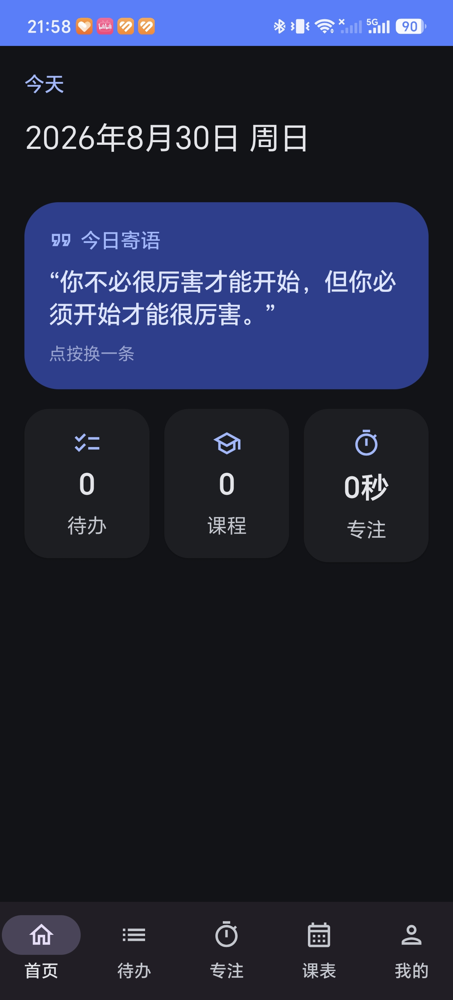
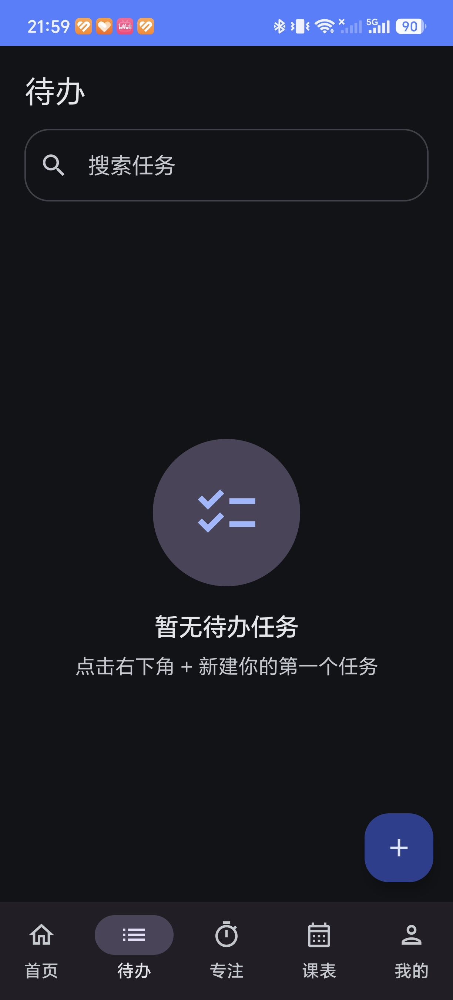
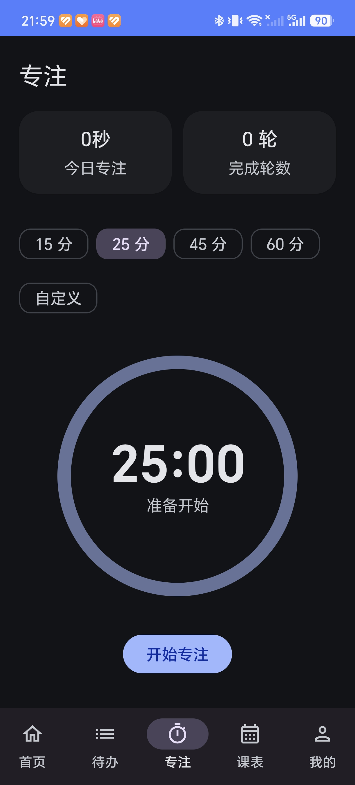
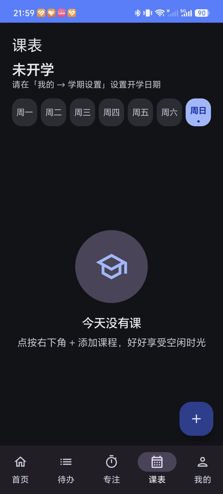

# SmartLife · 大学生活助手

> 基于 Kotlin + Jetpack Compose 开发的 Android 校园效率工具，支持待办、番茄专注、单双周课表、学期设置与 JSON 数据管理。

<p align="center">
  
  
  
  
  
</p>

## 📦 Download

> Download the latest APK from the Releases page.

👉 **[Download SmartLife APK · v1.0.0](/releases/latest)**

## 📱 Screenshots

| 首页 Home | 待办 Todo |
| --- | --- |
|  |  |

| 专注 Focus | 课表 Timetable |
| --- | --- |
|  |  |

## ✨ 功能介绍

### 🏠 Dashboard · 首页
今日日期与随机励志语（点按换一条），「今日待办 / 今日课程 / 今日专注」三张统计卡片——卡片可点击直达对应模块。

### ✅ Todo · 待办
新增 / 编辑 / 删除（长按确认）、完成勾选、三级优先级、**截止日期 + 时间**（精确到分钟）、实时搜索、逾期提示（已逾期 X 小时）。

### 🍅 Focus · 番茄专注
预设 15 / 25 / 45 / 60 分钟 + 自定义（5~180 分钟）；开始 / 暂停 / 继续 / 结束；圆形倒计时动画；退出页面计时不中断；结束经 WorkManager 本地通知提醒。

### 📚 Timetable · 课程表
周一至周日切换、**多星期课程**、**单双周（每周 / 单周 / 双周）**、**学期设置**（自定义开学日期，自动计算当前周数与单双周）、考试倒计时、任课老师 / 教室 / 时间。

### 👤 Profile · 我的
数据统计（总待办 / 已完成 / 总专注时长 / 完成轮数）、**当前学期课程**入口、主题切换（跟随系统 / 浅色 / 深色）、JSON 一键导入导出、学期设置、关于。

## 🛠 技术栈

| 技术          | 用途    |
| ----------- | ----- |
| Kotlin      | 开发语言  |
| Compose     | UI    |
| Room        | 本地数据库 |
| DataStore   | 设置存储  |
| WorkManager | 后台任务  |
| Material 3  | 设计规范  |

## 📂 项目结构

```
SmartLife/
├── app/
│   ├── build.gradle.kts
│   └── src/main/
│       ├── AndroidManifest.xml
│       ├── java/com/smartlife/app/
│       │   ├── SmartLifeApplication.kt
│       │   ├── MainActivity.kt
│       │   ├── data/
│       │   │   ├── local/
│       │   │   │   ├── AppDatabase.kt
│       │   │   │   ├── Converters.kt
│       │   │   │   ├── Priority.kt
│       │   │   │   ├── WeekType.kt
│       │   │   │   ├── dao/
│       │   │   │   │   ├── BackupDao.kt
│       │   │   │   │   ├── CourseDao.kt
│       │   │   │   │   ├── FocusSessionDao.kt
│       │   │   │   │   ├── QuoteDao.kt
│       │   │   │   │   └── TaskDao.kt
│       │   │   │   └── entity/
│       │   │   │       ├── CourseEntity.kt
│       │   │   │       ├── FocusSessionEntity.kt
│       │   │   │       ├── QuoteEntity.kt
│       │   │   │       └── TaskEntity.kt
│       │   │   ├── QuotesProvider.kt
│       │   │   └── repository/
│       │   │       ├── CourseRepository.kt
│       │   │       ├── FocusSessionRepository.kt
│       │   │       ├── QuoteRepository.kt
│       │   │       ├── SettingsRepository.kt
│       │   │       └── TaskRepository.kt
│       │   ├── di/ServiceLocator.kt
│       │   ├── ui/
│       │   │   ├── components/
│       │   │   │   ├── DateField.kt
│       │   │   │   └── TimeField.kt
│       │   │   ├── navigation/
│       │   │   │   ├── NavGraph.kt
│       │   │   │   └── Routes.kt
│       │   │   ├── screen/
│       │   │   │   ├── dashboard/   (DashboardScreen / DashboardViewModel)
│       │   │   │   ├── focus/       (FocusScreen / FocusViewModel)
│       │   │   │   ├── profile/     (ProfileScreen / ProfileViewModel)
│       │   │   │   ├── semester/    (Semester / SemesterCourses)
│       │   │   │   ├── timetable/   (Timetable / CourseAddEditDialog)
│       │   │   │   └── todo/        (Todo / TodoAddEditDialog)
│       │   │   └── theme/
│       │   │       ├── Color.kt
│       │   │       ├── Shape.kt
│       │   │       ├── Theme.kt
│       │   │       ├── ThemeMode.kt
│       │   │       └── Type.kt
│       │   ├── util/
│       │   │   ├── DateUtils.kt
│       │   │   ├── JsonBackup.kt
│       │   │   └── WeekUtils.kt
│       │   └── worker/FocusReminderWorker.kt
│       └── res/
│           ├── drawable/
│           ├── mipmap-anydpi-v26/
│           ├── values/
│           └── values-night/
├── screenshots/            # 应用截图（占位，待补充真实图片）
├── gradle/wrapper/         # Gradle Wrapper 8.9
├── build.gradle.kts
├── settings.gradle.kts
├── gradle.properties
├── README.md
├── LICENSE
└── .gitignore
```

## 🏗 架构

```
Compose UI
    ↓
ViewModel
    ↓
Repository
    ↓
Room + DataStore
```

## 🚀 环境要求

- **Android Studio**（新版即可，自带 JDK）
- **最低 Android 版本**：Android 7.0（API 24，minSdk 24）
- **目标 / 编译 SDK**：34
- **JDK**：17
- **Gradle**：8.9（Wrapper 已内置）；AGP 8.7.0；Kotlin 2.0.21

## 📲 如何运行

1. 安装 **Android Studio**；
2. `File → Open` 选择本目录 `SmartLife/`；
3. 等待 Gradle Sync 完成（首次需联网下载依赖）；
4. 点击 **Run ▶** 选择模拟器或真机运行。

## 📦 如何构建 APK

```bash
# Debug APK
./gradlew assembleDebug
# 产物：app/build/outputs/apk/debug/app-debug.apk

# Release APK（默认调试签名，便于直接安装）
./gradlew assembleRelease
# 产物：app/build/outputs/apk/release/app-release-unsigned.apk
```

## 💾 数据备份 / 恢复

- **导出**：「我的」→「数据管理」→「导出 JSON」→ 系统分享保存；
- **导入**：「导入 JSON」→ 选择备份文件；
- 备份内容：待办、课程、专注记录、励志语；
- 安全机制：导入前完整校验 JSON，校验通过后在**单个事务**内替换，失败自动回滚，非法 / 版本不符的文件被拒绝。

## 📄 License

[MIT License](./LICENSE) · Copyright © 2026 SmartLife
